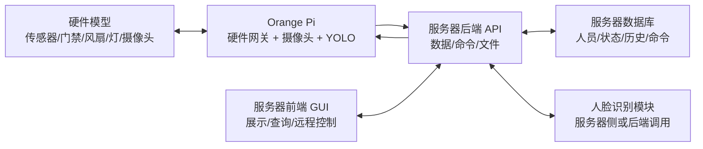

# 第27组软件组分工与接口文档

版本：v0.3
适用范围：第27组软件组，面向“智能家居原型”的阶段一组件开发与阶段二系统集成。  
软件组默认成员：高镜涵、杨济纶、董志新、李韶庸、汪任城。

## 1. 软件组目标

软件组负责把硬件模型采集到的数据、图像和控制动作接入到一个可演示、可查询、可扩展的信息系统中。最终系统需要支持：

- 授权人员信息管理。
- 从硬件模型获取照片并本地保存。
- 使用部署在 Orange Pi 上的 YOLO 进行目标识别。
- 使用人脸识别辅助门禁，至少完成“2 个真样本 + 1 个假样本”的开门判断演示。
- Web 或移动端 GUI 展示温度、门窗、灯光、风扇、识别结果等信息。
- 按时间范围查询温度、门窗、灯光等历史数据。
- 通过 GUI 远程控制灯、风扇或门禁等设备。
- 可选创新功能：摄像头检测到灯泡图片后，自动控制灯亮。

## 2. 五人分工

默认原则：每个人有一个主责模块，同时至少备份另一个模块，避免某个模块卡住后全组停摆。若成员已有明确技术偏好，可以只调整人员，不调整接口。

| 成员  | 主责           | 交付物                                     | 备份方向        |
| --- | ------------ | --------------------------------------- | ----------- |
| 杨济纶 | 硬件接入与设备网关    | 设备协议、串口/HTTP/MQTT 接入、遥控命令下发、硬件联调记录      | 后端接口联调      |
| 李韶庸 | 后端 API 与数据库  | REST API、数据库表、历史查询、命令队列、文件存储            | 前端数据接口      |
| 高镜涵 | GUI 前端与数据可视化 | 仪表盘、历史查询页面、远程控制页面、识别结果展示                | 演示材料与 UI 测试 |
| 汪任城 | YOLO 板端部署与目标识别 | Orange Pi 上 YOLO 环境、推理脚本、识别结果结构化输出、灯泡检测扩展 | 人脸识别        |
| 董志新 | 人脸识别与集成测试    | 授权人员录入、2 真 1 假门禁验证、端到端测试脚本、验收 checklist | YOLO 与报告材料  |

### 每日协作节奏

- 每天开始前 10 分钟同步：昨天完成什么、今天做什么、接口有没有变化。
- 每天结束前提交一次可运行成果：代码、截图、测试记录或接口 mock。
- 接口变更必须先写到本文档或 OpenAPI 文件，再改代码。
- v0.1 接口一旦前后端和硬件开始联调，只允许新增字段，不随意重命名或删除字段。

## 3. 推荐技术路线

为便于快速完成阶段一，推荐采用最小可行方案：

- 前端：Web 页面，部署在服务器 `http://82.156.238.244`，建议 Vue/React/普通 HTML 均可，重点是可演示。
- 后端：Python FastAPI 或 Node.js Express，部署在服务器 `http://82.156.238.244`。
- 数据库：部署在服务器，SQLite 起步，阶段二需要多人部署时再换 MySQL/PostgreSQL。
- YOLO 目标识别：部署在 Orange Pi 上，板端拍照后本地推理，并把图片和 `yolo_labels_json` 一起上传给后端。
- 人脸识别：本地注册 2 个授权人员，另设 1 个未授权样本；演示时输出 allow/deny。
- 板端部署：使用 Orange Pi / 华为开发板作为设备网关和 YOLO 边缘节点，默认设备 ID 为 `orange-pi-main`。
- 硬件接入：优先让开发板通过 HTTP 访问后端；如果硬件只支持串口，则由杨济纶负责写一个串口转 HTTP 的网关程序。

## 4. 系统结构



## 5. 数据模型

### Device 设备

| 字段        | 类型      | 说明                                      |
| --------- | ------- | --------------------------------------- |
| id        | string  | 设备 ID，如 `orange-pi-main`                |
| name      | string  | 设备名称                                    |
| type      | string  | `gateway`、`camera`、`door`、`light`、`fan` |
| online    | boolean | 是否在线                                    |
| last_seen | string  | 最近心跳时间，ISO 8601                         |

### Telemetry 状态数据

| 字段            | 类型      | 说明            |
| ------------- | ------- | ------------- |
| id            | string  | 记录 ID         |
| device_id     | string  | 设备 ID         |
| captured_at   | string  | 采集时间，ISO 8601 |
| temperature_c | number  | 摄氏温度          |
| door_open     | boolean | 门是否打开         |
| window_open   | boolean | 窗是否打开         |
| light_level   | integer | 灯光亮度，0-100    |
| fan_on        | boolean | 风扇是否开启        |

### Person 授权人员

| 字段            | 类型      | 说明                          |
| ------------- | ------- | --------------------------- |
| id            | string  | 人员 ID                       |
| name          | string  | 姓名或展示名                      |
| role          | string  | `student`、`teacher`、`guest` |
| authorized    | boolean | 是否允许开门                      |
| face_enrolled | boolean | 是否已录入人脸                     |

### Photo 图片与识别结果

| 字段              | 类型     | 说明                       |
| --------------- | ------ | ------------------------ |
| id              | string | 图片 ID                    |
| device_id       | string | 摄像头或网关 ID                |
| captured_at     | string | 拍摄时间                     |
| file_url        | string | 本地保存路径或访问 URL            |
| yolo_labels     | array  | YOLO 识别标签                |
| face_result     | object | 人脸识别结果                   |
| access_decision | string | `allow`、`deny`、`unknown` |

### Command 远程控制命令

| 字段          | 类型     | 说明                               |
| ----------- | ------ | -------------------------------- |
| id          | string | 命令 ID                            |
| device_id   | string | 目标设备                             |
| type        | string | 命令类型                             |
| payload     | object | 命令参数                             |
| status      | string | `pending`、`sent`、`done`、`failed` |
| created_at  | string | 创建时间                             |
| executed_at | string | 执行时间，可为空                         |

命令类型约定：

- `SET_LIGHT`：设置灯光亮度，payload 为 `{ "level": 0-100 }`。
- `SET_FAN`：开关风扇，payload 为 `{ "on": true/false }`。
- `OPEN_DOOR`：开门，payload 可为空。
- `CLOSE_DOOR`：关门，payload 可为空。
- `REQUEST_PHOTO`：请求摄像头拍照，payload 可为空。

## 6. API 统一规范

生产基础地址：`http://82.156.238.244`

本地开发地址：`http://localhost:8000`

统一响应格式：

```json
{
  "ok": true,
  "data": {},
  "error": null
}
```

错误响应格式：

```json
{
  "ok": false,
  "data": null,
  "error": {
    "code": "INVALID_REQUEST",
    "message": "temperature_c is required"
  }
}
```

时间格式统一使用 ISO 8601，例如 `2026-07-06T09:30:00+08:00`。温度单位固定为摄氏度，灯光亮度固定为 0-100 的整数。

## 7. 前后端接口

### 7.1 健康检查

`GET /api/health`

返回：

```json
{
  "ok": true,
  "data": {
    "status": "ok",
    "version": "0.1"
  },
  "error": null
}
```

### 7.2 获取设备列表

`GET /api/devices`

返回：

```json
{
  "ok": true,
  "data": [
    {
      "id": "orange-pi-main",
      "name": "Orange Pi Smart Home Gateway",
      "type": "gateway",
      "online": true,
      "last_seen": "2026-07-06T09:30:00+08:00"
    }
  ],
  "error": null
}
```

### 7.3 查询最新状态

`GET /api/status/latest`

返回：

```json
{
  "ok": true,
  "data": {
    "device_id": "orange-pi-main",
    "temperature_c": 28.4,
    "door_open": false,
    "window_open": true,
    "light_level": 70,
    "fan_on": true,
    "captured_at": "2026-07-06T09:30:00+08:00"
  },
  "error": null
}
```

### 7.4 查询历史状态

`GET /api/telemetry?from=2026-07-06T08:00:00+08:00&to=2026-07-06T12:00:00+08:00&limit=200`

返回：

```json
{
  "ok": true,
  "data": [
    {
      "device_id": "orange-pi-main",
      "captured_at": "2026-07-06T09:30:00+08:00",
      "temperature_c": 28.4,
      "door_open": false,
      "window_open": true,
      "light_level": 70,
      "fan_on": true
    }
  ],
  "error": null
}
```

### 7.5 管理授权人员

`GET /api/persons`

`POST /api/persons`

请求：

```json
{
  "name": "Person A",
  "role": "student",
  "authorized": true
}
```

`PATCH /api/persons/{person_id}`

`DELETE /api/persons/{person_id}`

### 7.6 上传人脸样本

`POST /api/persons/{person_id}/face-samples`

请求类型：`multipart/form-data`

字段：

- `image`：人脸图片文件。

返回：

```json
{
  "ok": true,
  "data": {
    "person_id": "person_001",
    "face_enrolled": true
  },
  "error": null
}
```

### 7.7 获取图片与识别结果

`GET /api/photos?limit=50`

返回：

```json
{
  "ok": true,
  "data": [
    {
      "id": "photo_001",
      "device_id": "orange-pi-main",
      "captured_at": "2026-07-06T09:30:00+08:00",
      "file_url": "/uploads/photo_001.jpg",
      "yolo_labels": [
        { "label": "person", "confidence": 0.91 },
        { "label": "light bulb", "confidence": 0.78 }
      ],
      "face_result": {
        "matched_person_id": "person_001",
        "matched_name": "Person A",
        "confidence": 0.86
      },
      "access_decision": "allow"
    }
  ],
  "error": null
}
```

### 7.8 发送控制命令

`POST /api/commands`

请求：

```json
{
  "device_id": "orange-pi-main",
  "type": "SET_LIGHT",
  "payload": {
    "level": 80
  }
}
```

返回：

```json
{
  "ok": true,
  "data": {
    "id": "cmd_001",
    "device_id": "orange-pi-main",
    "type": "SET_LIGHT",
    "payload": {
      "level": 80
    },
    "status": "pending",
    "created_at": "2026-07-06T09:31:00+08:00"
  },
  "error": null
}
```

### 7.9 实时事件

`GET /api/events?limit=100`

用于页面显示最近事件，例如“温度过高，风扇已开启”“检测到授权人员，门禁允许打开”。

可选增强：`WebSocket /ws/events`，前端实时接收状态更新。阶段一来不及做 WebSocket 时，前端每 2 秒轮询 `/api/status/latest` 即可。

## 8. 硬件与软件接口

硬件组与软件组只需要围绕 3 类接口对齐：状态上报、图片与 YOLO 结果上传、命令拉取/确认。Orange Pi / 华为开发板作为统一网关，负责采集传感器数据、拍照、在本地运行 YOLO，并把结果转换成下面的 HTTP 接口。

### 8.1 状态上报

`POST /api/device/telemetry`

请求：

```json
{
  "device_id": "orange-pi-main",
  "captured_at": "2026-07-06T09:30:00+08:00",
  "temperature_c": 28.4,
  "door_open": false,
  "window_open": true,
  "light_level": 70,
  "fan_on": true
}
```

返回：

```json
{
  "ok": true,
  "data": {
    "saved": true
  },
  "error": null
}
```

### 8.2 图片上传

`POST /api/device/photos`

请求类型：`multipart/form-data`

字段：

- `device_id`：如 `orange-pi-main`。
- `captured_at`：拍摄时间。
- `image`：图片文件。
- `yolo_labels_json`：Orange Pi 本地 YOLO 推理结果，JSON 字符串；没有识别目标时传 `[]`。

请求示例：

```bash
curl -X POST http://82.156.238.244/api/device/photos \
  -F "device_id=orange-pi-main" \
  -F "captured_at=2026-07-06T09:30:00+08:00" \
  -F "image=@/home/orangepi/test.jpg" \
  -F 'yolo_labels_json=[{"label":"person","confidence":0.91},{"label":"light bulb","confidence":0.78}]'
```

后端收到图片和 YOLO 结果后：

1. 保存图片到服务器本地或对象存储。
2. 解析并保存 `yolo_labels_json`。
3. 调用人脸识别或使用人脸识别 mock 结果。
4. 写入图片记录、YOLO 结果和人脸识别结果。
5. 如人脸识别为授权人员，可自动生成 `OPEN_DOOR` 命令。
6. 如 Orange Pi 上传的 YOLO 结果包含 `light bulb`，可自动生成 `SET_LIGHT` 命令作为创新功能。

### 8.3 硬件拉取待执行命令

`GET /api/device/commands/pending?device_id=orange-pi-main`

返回：

```json
{
  "ok": true,
  "data": [
    {
      "id": "cmd_001",
      "type": "SET_LIGHT",
      "payload": {
        "level": 80
      }
    }
  ],
  "error": null
}
```

### 8.4 硬件确认命令执行结果

`POST /api/device/commands/{command_id}/ack`

请求：

```json
{
  "device_id": "orange-pi-main",
  "status": "done",
  "message": "light level set to 80"
}
```

返回：

```json
{
  "ok": true,
  "data": {
    "updated": true
  },
  "error": null
}
```

### 8.5 串口备用协议

如果硬件不能直接发送 HTTP，则设备通过串口发送 JSON Lines，由软件网关转成 HTTP。

硬件发送状态：

```json
{"type":"telemetry","device_id":"orange-pi-main","temperature_c":28.4,"door_open":false,"window_open":true,"light_level":70,"fan_on":true}
```

软件发送命令：

```json
{"type":"command","id":"cmd_001","command":"SET_LIGHT","payload":{"level":80}}
```

硬件确认：

```json
{"type":"ack","id":"cmd_001","status":"done","message":"ok"}
```

## 9. 模块之间的交付边界

| 模块      | 部署位置 | 输入               | 输出                         | 负责人 |
| ------- | --- | ---------------- | -------------------------- | --- |
| 设备网关    | Orange Pi | 硬件串口/HTTP 数据     | `/api/device/*` 请求、命令执行结果  | 杨济纶 |
| YOLO 服务 | Orange Pi | 摄像头图片             | `[{label, confidence}]`，通过 `yolo_labels_json` 上传 | 汪任城 |
| 后端 API  | 服务器 `http://82.156.238.244` | 前端请求、设备请求、YOLO 结果、人脸识别结果 | 数据库记录、JSON 响应、命令队列         | 李韶庸 |
| 前端 GUI  | 服务器 `http://82.156.238.244` | `/api/*` JSON    | 页面展示、远程控制请求                | 高镜涵 |
| 人脸识别服务  | 服务器或后端模块 | 图片路径、人员样本库       | `allow/deny/unknown` 与匹配人员 | 董志新 |

## 10. 阶段一建议计划

### 7月6日：接口冻结与 mock 跑通

- 确定本文档 v0.3，明确前后端部署在服务器，YOLO 部署在 Orange Pi。
- 后端先实现 `/api/health`、`/api/status/latest`、`/api/commands` 的 mock。
- 前端用 mock 数据画出仪表盘。
- 识别组准备 Orange Pi YOLO 环境和人脸识别 demo 图片。
- 硬件接入组与硬件组确认是否走 HTTP 或串口。

### 7月7日：核心功能初版

- 后端完成数据库表和状态上报接口。
- 前端完成状态展示、历史查询、远程控制按钮。
- Orange Pi 上的 YOLO 能对本地图片输出标签，并整理为 `yolo_labels_json`。
- 人脸识别能完成 2 真 1 假的本地判断。
- 设备网关能模拟上传温度、门窗、灯光状态。

### 7月8日：联调

- 硬件真实数据或网关模拟数据进入后端。
- 前端能看到实时状态和历史曲线。
- Orange Pi 上传图片和 YOLO 结果后，服务器能保存并展示识别结果。
- GUI 发出的控制命令能被硬件或网关拉取并 ack。

### 7月9日：验收脚本与异常处理

- 准备固定演示流程。
- 增加错误提示：设备离线、图片识别失败、命令失败。
- 统一截图、录屏和测试记录。
- 梳理阶段二需要继续扩展的 TODO。

### 7月10日：阶段一交付

- 每个模块保留可运行版本。
- 输出接口文档、功能截图、测试 checklist。
- 软件组能独立演示：状态展示、历史查询、图片识别、人脸门禁、远程控制。

## 11. 验收 checklist

软件组完成以下项目即可认为阶段一任务达标：

- [ ] 后端服务可启动，`/api/health` 返回正常。
- [ ] GUI 能展示温度、门窗、灯光、风扇状态。
- [ ] GUI 能查询一段时间内的历史状态。
- [ ] GUI 能发出至少一种远程控制命令，如开灯或开风扇。
- [ ] 设备网关能上传至少 5 条状态数据。
- [ ] 摄像头图片或本地模拟图片能上传并保存。
- [ ] Orange Pi 上的 YOLO 能识别至少一种目标，例如 person 或 light bulb，并通过接口上传结果。
- [ ] 人脸识别能演示 2 个授权样本通过、1 个非授权样本拒绝。
- [ ] 识别结果能在 GUI 中展示。
- [ ] 控制命令有 pending、done 或 failed 状态。
- [ ] 软件组保留一份演示脚本和异常处理说明。

## 12. 演示流程建议

1. 打开 GUI 首页，展示当前温度、门窗状态、灯光亮度、风扇状态。
2. 模拟或真实上传一条高温数据，展示风扇自动开启或远程开启。
3. 点击灯光控制按钮，设置灯光亮度为 80，展示命令被硬件确认。
4. Orange Pi 拍照并在本地运行 YOLO，上传图片和识别结果后在前端展示。
5. 展示授权人员 A/B 的人脸识别开门成功。
6. 展示未授权人员 C 的识别拒绝。
7. 查询最近一段时间的历史数据。
8. 如果时间允许，展示检测到灯泡图片后自动开灯的创新功能。

## 13. 风险与降级方案

| 风险             | 降级方案                       |
| -------------- | -------------------------- |
| 硬件暂时接不上        | 设备网关先用模拟数据 POST 到后端        |
| 摄像头图片上传失败      | 使用本地图片上传接口完成识别链路           |
| Orange Pi 上 YOLO 模型运行慢 | 阶段一先识别固定测试图，或使用轻量模型        |
| 人脸识别准确率不稳      | 使用固定光照和固定样本，明确 2 真 1 假演示场景 |
| 前端来不及做复杂图表     | 先做表格和最新状态卡片，历史曲线作为增强       |
| WebSocket 来不及做 | 前端轮询 `/api/status/latest`  |
